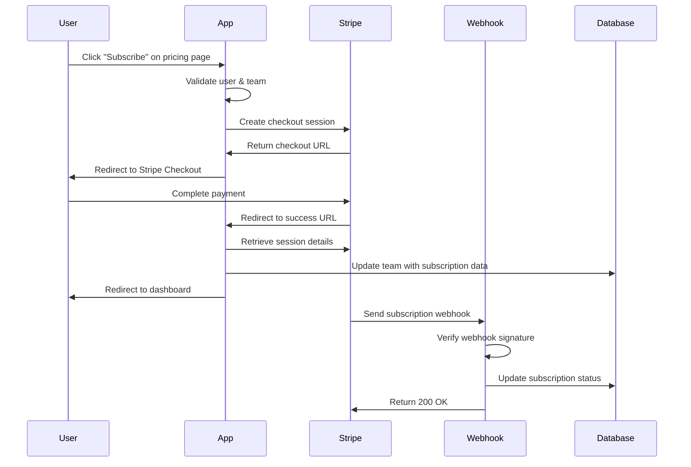

# Stripe Integration Guide

This repository implements a complete Stripe subscription system for a SaaS application built with Next.js. This guide explains how Stripe works in this codebase, including setup, architecture, and the payment flow.

## Table of Contents

- [Overview](#overview)
- [Setup & Configuration](#setup--configuration)
- [Architecture & File Structure](#architecture--file-structure)
- [Payment Flow & Sequence Diagram](#payment-flow--sequence-diagram)
- [Database Schema](#database-schema)
- [Key Components](#key-components)
- [Testing](#testing)
- [Production Deployment](#production-deployment)
- [Troubleshooting](#troubleshooting)

## Overview

This implementation provides:
- **Subscription Management**: Monthly/yearly billing with 14-day free trials
- **Checkout Flow**: Secure payment processing via Stripe Checkout
- **Customer Portal**: Self-service subscription management
- **Webhook Integration**: Real-time subscription status updates
- **Multi-tier Pricing**: Support for different subscription plans (Base & Plus)

## Setup & Configuration

### 1. Environment Variables

Create a `.env` file with the following variables:

```bash
# Stripe Configuration
STRIPE_SECRET_KEY=sk_test_***           # Your Stripe secret key
STRIPE_WEBHOOK_SECRET=whsec_***         # Webhook endpoint secret
BASE_URL=http://localhost:3000          # Your application URL

# Database
POSTGRES_URL=postgresql://***

# Authentication
AUTH_SECRET=***
```

### 2. Stripe Dashboard Setup

1. Create products and prices in your Stripe Dashboard
2. Configure webhook endpoints
3. Set up billing portal configuration

### 3. Local Development

Install Stripe CLI for local webhook testing:

```bash
stripe login
stripe listen --forward-to localhost:3000/api/stripe/webhook
```

## Architecture & File Structure

```
lib/payments/
├── stripe.ts              # Core Stripe client and functions
└── actions.ts             # Server actions for forms

app/api/stripe/
├── checkout/route.ts      # Handles successful checkout
└── webhook/route.ts       # Processes Stripe webhooks

app/(dashboard)/
└── pricing/page.tsx       # Pricing page with Stripe integration

lib/db/
└── schema.ts             # Database schema with Stripe fields
```

## Payment Flow & Sequence Diagram



### Detailed Flow Steps

1. **Subscription Initiation** (`pricing/page.tsx`)
   - User selects a plan on the pricing page
   - Form submits with `priceId` to `checkoutAction`

2. **Checkout Session Creation** (`lib/payments/stripe.ts:14-47`)
   - Validates user authentication and team membership
   - Creates Stripe checkout session with:
     - 14-day trial period
     - Promotion codes enabled
     - Success/cancel URLs configured
     - Customer ID linking

3. **Payment Processing** (Stripe Checkout)
   - User completes payment on Stripe's secure checkout page
   - Stripe handles payment method validation and processing

4. **Success Handling** (`app/api/stripe/checkout/route.ts`)
   - Retrieves checkout session from Stripe
   - Updates team record with subscription details:
     - `stripeCustomerId`
     - `stripeSubscriptionId`
     - `stripeProductId`
     - `planName`
     - `subscriptionStatus`

5. **Webhook Processing** (`app/api/stripe/webhook/route.ts`)
   - Handles subscription lifecycle events
   - Updates database when subscriptions change
   - Processes `customer.subscription.updated` and `customer.subscription.deleted`

## Database Schema

The `teams` table stores Stripe-related data:

```sql
CREATE TABLE teams (
  id SERIAL PRIMARY KEY,
  name VARCHAR(100) NOT NULL,
  stripe_customer_id TEXT UNIQUE,      -- Links to Stripe customer
  stripe_subscription_id TEXT UNIQUE,  -- Current subscription ID
  stripe_product_id TEXT,              -- Subscribed product
  plan_name VARCHAR(50),               -- Human-readable plan name
  subscription_status VARCHAR(20),     -- active, trialing, canceled, etc.
  created_at TIMESTAMP DEFAULT NOW(),
  updated_at TIMESTAMP DEFAULT NOW()
);
```

## Key Components

### Core Stripe Client (`lib/payments/stripe.ts`)

```typescript
export const stripe = new Stripe(process.env.STRIPE_SECRET_KEY!, {
  apiVersion: '2025-04-30.basil'
});
```

### Main Functions

1. **`createCheckoutSession()`** - Creates Stripe checkout sessions
2. **`createCustomerPortalSession()`** - Generates billing portal access
3. **`handleSubscriptionChange()`** - Processes webhook events
4. **`getStripePrices()`** - Fetches active pricing data
5. **`getStripeProducts()`** - Retrieves product information

### Server Actions (`lib/payments/actions.ts`)

- **`checkoutAction`** - Initiates subscription checkout
- **`customerPortalAction`** - Redirects to billing portal

### API Routes

- **`/api/stripe/checkout`** - Handles post-payment processing
- **`/api/stripe/webhook`** - Receives Stripe webhook events

## Testing

### Test Card Numbers

Use these test cards in development:

| Card Number | Description |
|-------------|-------------|
| 4242424242424242 | Visa - Succeeds |
| 4000000000000002 | Visa - Declined |
| 4000000000009995 | Visa - Insufficient funds |

### Local Testing Setup

1. Start your development server:
   ```bash
   npm run dev
   ```

2. In another terminal, start Stripe webhook forwarding:
   ```bash
   stripe listen --forward-to localhost:3000/api/stripe/webhook
   ```

3. Test the complete flow:
   - Visit `/pricing`
   - Click subscribe
   - Complete checkout with test card
   - Verify database updates

## Production Deployment

### 1. Webhook Configuration

1. Go to Stripe Dashboard → Webhooks
2. Create endpoint: `https://yourdomain.com/api/stripe/webhook`
3. Select events:
   - `customer.subscription.updated`
   - `customer.subscription.deleted`
4. Copy webhook secret to `STRIPE_WEBHOOK_SECRET`

### 2. Environment Variables

Update production environment with:
- Live Stripe secret key (`sk_live_***`)
- Production webhook secret
- Production base URL

### 3. SSL Certificate

Ensure your production domain has a valid SSL certificate for webhook delivery.

## Troubleshooting

### Common Issues

**Webhook signature verification failed**
- Verify `STRIPE_WEBHOOK_SECRET` matches your endpoint
- Check webhook endpoint URL configuration
- Ensure raw request body is passed to `stripe.webhooks.constructEvent()`

**Team not found for Stripe customer**
- Check if customer ID was properly saved during checkout
- Verify team-user relationship exists in database
- Review checkout success handler logic

**Subscription status not updating**
- Confirm webhook endpoint is receiving events
- Check webhook event types are handled
- Verify database update queries

### Debug Mode

Enable detailed logging by adding console.log statements in:
- `handleSubscriptionChange()` function
- Webhook route handler
- Checkout success handler

### Webhook Testing

Test webhook delivery using Stripe CLI:

```bash
# Trigger a test event
stripe trigger customer.subscription.updated

# View webhook attempts
stripe events list --limit 10
```

## Security Considerations

1. **Webhook Signature Verification**: Always verify webhook signatures to prevent unauthorized requests
2. **Environment Variables**: Never commit Stripe keys to version control
3. **HTTPS Only**: Use HTTPS in production for webhook endpoints
4. **Input Validation**: Validate all data received from Stripe webhooks
5. **Error Handling**: Implement proper error handling to prevent sensitive data exposure

## Additional Resources

- [Stripe API Documentation](https://stripe.com/docs/api)
- [Stripe Webhooks Guide](https://stripe.com/docs/webhooks)
- [Next.js API Routes](https://nextjs.org/docs/api-routes/introduction)
- [Drizzle ORM Documentation](https://orm.drizzle.team/)